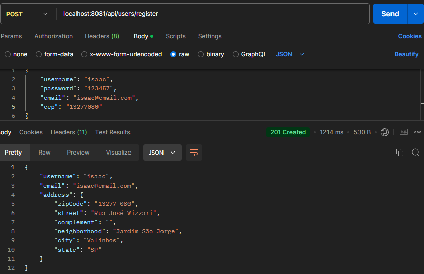
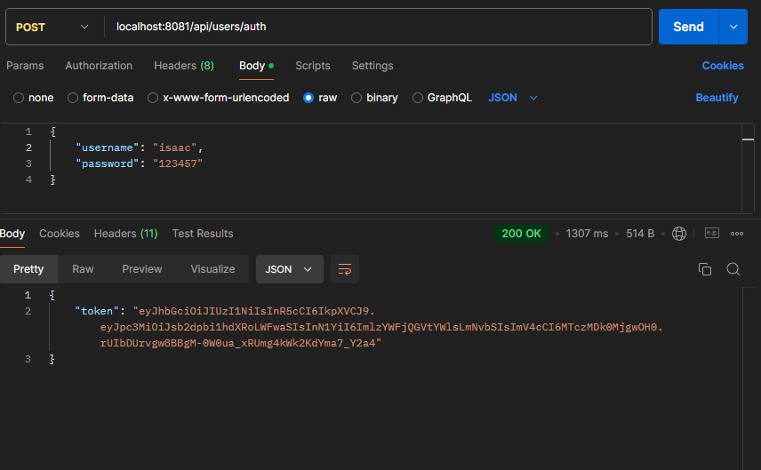
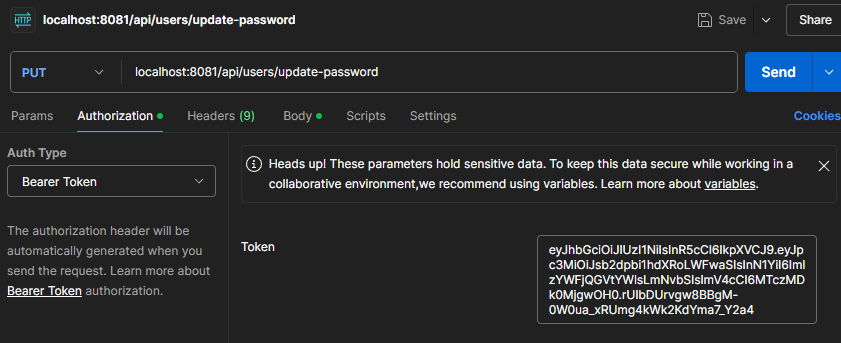
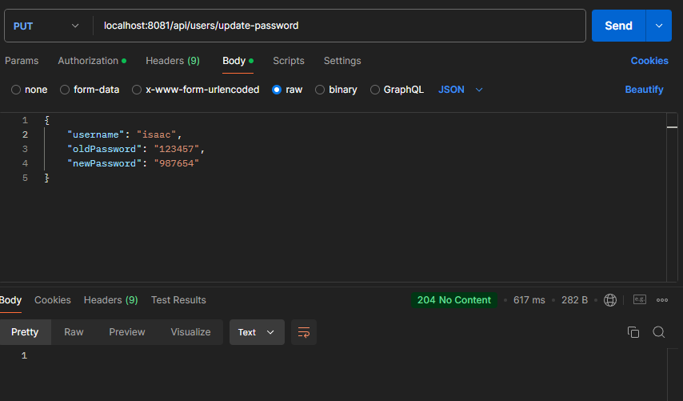
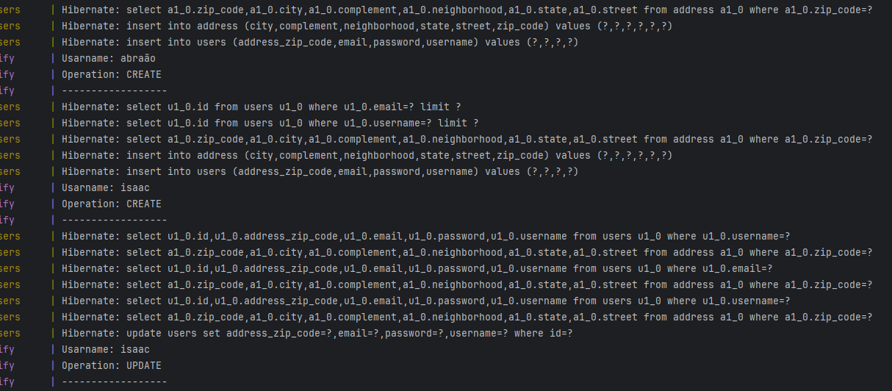

# Projeto de API com Docker, RabbitMQ e MySQL

This project consists of two APIs built with Spring Boot: **User** and **Notify.** The User API handles user registration, authentication, and password updates, storing data in a MySQL database and ensuring security with JWT authentication. Communication between User and Notify is facilitated via RabbitMQ, allowing the creation and update of user messages. All services, along with MySQL and RabbitMQ, run in Docker containers, simplifying setup and environment execution.
## Índice
1. Technologies Used
2. Project Structure
3. API Endpoints
4. Docker Compose Execution Guide


## 1 Technologies Used

- Spring Boot
- Docker e Docker Compose
- RabbitMQ (messaging)
- MySQL (messaging)
- JWT for authentication
- Postman (for API testing)


## 2 Project Structure

- ***src/main/java/com.wallace.msusers.api*** =  Contains the application layer architecture responsible for managing HTTP requests.


- ***src/main/java/com.wallace.msusers.domain.entities*** = Contains the domain entities representing the primary objects of the system.


- ***src/main/java/com.wallace.msusers.dto*** =  Contains Data Transfer Objects (DTOs).


- ***src/main/java/com.wallace.msusers.exception*** = Contains classes related to custom exception handling.


- ***src/main/java/com.wallace.msusers.infra.rabbitmq*** = Contains the configuration and integration logic with RabbitMQ.


- ***src/main/java/com.wallace.msusers.infra.security*** = Contains classes related to JWT usage for securing API routes.


## 3 API Endpoints

### Register User

**EndPoint:** POST /api/users/register

**Description:** Registers a new user



### Get Token

**EndPoint:** POST /api/users/auth

**Description** Retrieve token for password update




### Authenticate and Update Password


**EndPoint:** POST /api/users/update-password

**Description**  Authenticate token




**EndPoint:** POST /api/users/update-password

**Description** Update password




### Notify Service Status

Here is an example of the Notify service status displayed in the terminal:

This section, along with the image, visually shows the Notify service running status in the terminal.




## 4 Docker Compose Execution Guide

1. Clone the project repository to your machine:
   ```bash
   git clone https://github.com/rodrigueswallace/Projeto-de-API-com-Docker-RabbitMQ-e-MySQL.git
    ```
   
2. Check Docker and Docker Compose versions:
    ```bash
    docker --version
    docker compose --version
    ```
3. Run the command:
    ```bash
    docker-compose up --build
    ```

This command will:

- Create and start containers for MySQL, RabbitMQ, and the application.
- Set up the network so the services can communicate with each other.

4. Verify if the services are running:

- MySQL: Port 3307
- RabbitMQ: Port 5672
- API: Port 8081

## Final Considerations

- **Testing Environment:** Use Postman to make requests to the endpoints as described.

